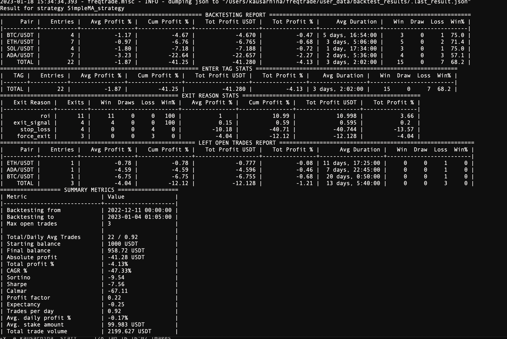
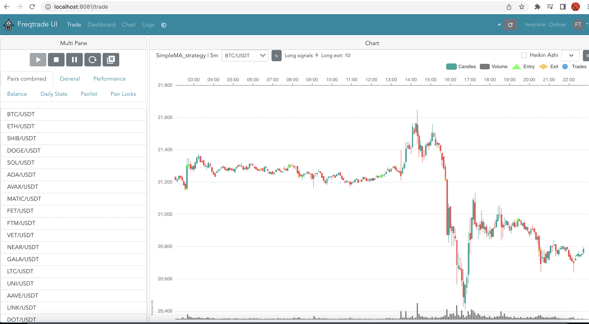

# algorithmic_trading_prj

This project focuses on using machine learning to optimize trading strategies for crypto currency pairs using Jupiter Lab then deploys it on Freqtrade, a free and open source crypto trading bot. 


*Target Goal*
Identify the best of 2 trading strategies to use with Bitcoin data, and trial 3 machine learning classifier models for best predictive performance. 
Demonstrate the advantages and disadvantages of using an online, open source crypto trading bot for deploying and backtesting one of the strategies. 

We choose 'Exponential Moving Average Crossover' and 'Simple Moving Average/Relative Strength Index/Bollinger Bands' to analyze in this project. The strategies were coded into Jupyter Notebooks using Python.  These strategies were then run using BTC/USD data from January 2019 until January 2023. The actual returns were compared with the strategy produced returns, and the strategy was then optimized for best performance.  The OHLCV coin data and strategy indicators were separated into training and testing data sets before being run through 3 univariate classification models, Support Vector Classifier, RandomForest Classifier, and k Nearest Neighbor Classifier. The models were evaluated and backtested, before a final analysis of best strategy and optimal model was chosen.

One of the strategies was used in the open source, online crypto trading bot Freqtrade. The strategy could then easily be papertraded, backtested and modified. Freqtrade also allows easy access to crypto coin data, strategy options, AI model options, and backtesting options that can be configured by the user in Python. The integrated WebUI in the bot makes visualization of the strategy easy.

## Technologies

This project leverages python 3.8.9 with the following packages:

* [freqtrade](https://www.freqtrade.io/en/stable/) - free and open source crypto trading bot written in Python


---

## Installation Guide

Follow the instructions to install and run freqtrade bot on your machine as per fraqtrade website (https://www.freqtrade.io/en/stable/)


The freqtrade installation steps for Mac M1 chip are available in **freqtrade_MacOS_M1_Installation.pdf**.


Before running the application on Jupiter Lab first install the dependencies in conda dev environment.

```python

    conda create -n dev python=3.7 anaconda

    python -m ipykernel install --user --name dev

    conda activate dev

    pip install -r requirements.txt

    conda deactivate 
  
```
---


##  Usage

To use the **algorithmic_trading_prj**  analyse / decide the best strategy and run it through freqtrade bot


```python

   1) freqtrade command to download data :

   freqtrade download-data --exchange binanceus --pairs ETH/USDT XRP/USDT BTC/USDT ADA/USDT SOL/USDT INCH/USDT ALGO/USDT --prepend --timerange  20221201-20230112 --timeframe 3m

   2) freqtrade command for backtesting :

   freqtrade backtesting --strategy SimpleMA_strategy --timerange 20221211-20230111 --config config_backtesting.json --timeframe 5m

   3) freqtrade command to start the bot with backtested strategy :

   freqtrade trade --config config.json --strategy SimpleMA_strategy

```





---
## Questions to Answer

```python

    1) which trade strategy is best for predicting BTC/USD ?
    2) which machine learning classifier predicts the most accurate buy/sell signals ?

```

---
## Research Resources/Datasets

```python
    
    https://www.cryptodatadownload.com/   for historical coin csv files
    
    Try different ML models in Jupyter lab and decide the best strategy
    Perform backtesting for proposed strategy in Jupyter lab 
    FreqAI - with different ML models
    backtest, run strategy in localhost and cloud using FreqTrade

```
---
## Project Tasks

```python
    1) Try different ML models in Jupyter lab and decide the best strategy - Jodi
    2) Perform backtesting for proposed strategy in Jupyter lab - Marissa
    3) FreqAI - with different ML models - Edith
    4) backtest, run strategy in localhost and cloud using FreqTrade - Kausar

```
---

## Contributors

Marissa Gonzalas

Edith Chou

Jodi Artman

Kausar Hina

---

## License

MIT

