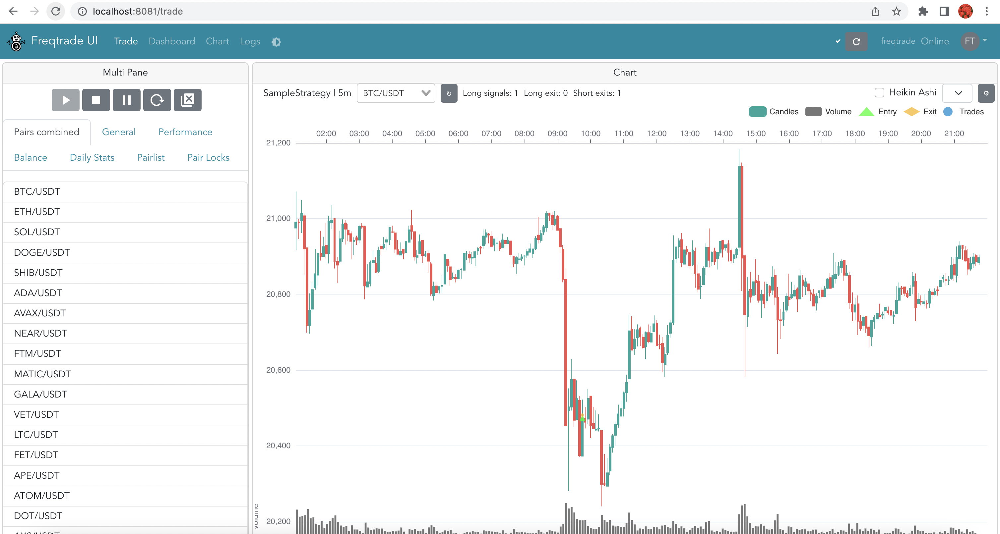

# algorithmic_trading_prj

The goal of this project is to show the time leveraging effect of using an exsiting 'sandbox' trading platform for testing strategies, machine learning models, backtesting and visualization vs doing all of the work in Jupyter Lab/VS Code.

We are plannning to choose 2 trading strategies and test them on the same data in 3 different machine learning models using Jupyter lab to find the model and strategy with the best return (will include backtesting and evaluation metrics and visualizations of results). The same strategies will be configured into the online trading bot FreqTrade using its commands to show the versatility and configuration options that are availble to traders with knowledge of python coding, financial strategies, and machine learning.


## Technologies

This project leverages python 3.8.9 with the following packages:

* [freqtrade](https://www.freqtrade.io/en/stable/) - free and open source crypto trading bot written in Python


---

## Installation Guide

Follow the instructions to install and run freqtrade bot on your machine as per fraqtrade website (https://www.freqtrade.io/en/stable/)


The freqtrade installation steps for Mac M1 chip are available in **freqtrade_MacOS_M1_Installation.pdf**.

---


##  Usage

To use the **algorithmic_trading_prj**  analyse / decide the best strategy and run it through freqtrade bot




---
## Questions to Answer

```python

    1) which strategy should be used to run the frqtrade bot ?

```

---
## Research Resources/Datasets

```python

    Try different ML models in Jupyter lab and decide the best strategy
    Perform backtesting for proposed strategy in Jupyter lab 
    FreqAI - with different ML models
    backtest, run strategy in localhost and cloud using FreqTrade

```
---
## Project Tasks

```python
    1) Try different ML models in Jupyter lab and decide the best strategy - Jodi
    2) Perform backtesting for proposed strategy in Jupyter lab - Marissa
    3) FreqAI - with different ML models - Edith
    4) backtest, run strategy in localhost and cloud using FreqTrade - Kausar

```
---

## Contributors

Marissa Gonzalas

Edith Chou

Jodi Artman

Kausar Hina

---

## License

MIT

